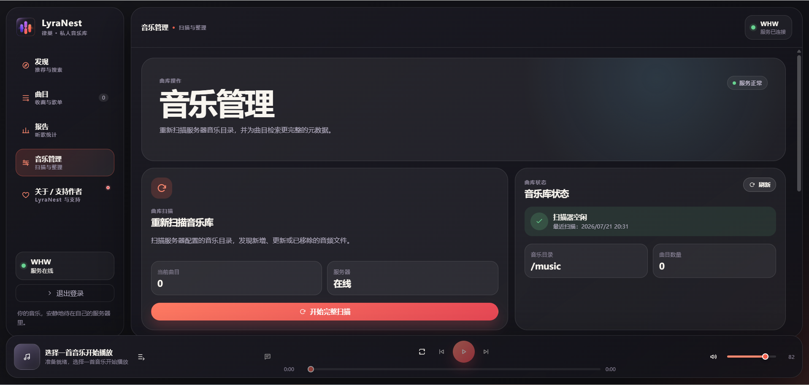

# LyraNest Community（律巢社区版）

<p align="center">
  
</p>

<p align="center">一套轻量、自托管、跨平台的个人音乐库服务。</p>

<p align="center">
  <a href="https://github.com/WHWgogogo/LyraNest-Community/releases/latest">下载最新版</a> ·
  <a href="https://github.com/WHWgogogo/LyraNest-Community/issues">提交问题</a> ·
  <a href="docs/deployment.md">部署文档</a>
</p>

LyraNest Community 是律巢的开源社区版本，专注于稳定、清晰的个人音乐库体验。将音乐文件保存在自己的服务器、NAS 或电脑中，即可通过 Web、Windows 和 Android 客户端浏览、搜索与播放音乐。

当前版本：`1.0.0`

## 功能一览

- 用户注册、登录与基础鉴权
- 配置服务器地址，连接自建音乐服务
- 扫描本地音乐目录并建立曲库
- 按全部、收藏、专辑、艺术家、歌单浏览曲目
- 按歌名、歌手、专辑、文件名进行基础搜索
- 播放、暂停、上一首、下一首与播放列表管理
- 顺序播放、列表循环、单曲循环、随机播放
- 播放页基础歌词读取与显示
- 收藏和歌单数据跨 Web、Windows、Android 同步
- Docker Compose 部署、数据备份、健康检查与升级指引

## 界面预览

### 初次使用


### 曲库浏览


### 音乐管理



## 获取客户端与服务端

请前往 [GitHub Releases](https://github.com/WHWgogogo/LyraNest-Community/releases/latest) 下载与系统架构匹配的发行文件：

| 文件 | 说明 |
| --- | --- |
| `LyraNest-Community-Android-arm64-1.0.0.apk` | Android ARM64 客户端 |
| `LyraNest-Community-Windows-x64-1.0.0.zip` | Windows x64 桌面客户端 |
| `LyraNest-Community-Server-linux-amd64-1.0.0.zip` | Linux x64 服务端离线部署包 |
| `SHA256SUMS.txt` | 发布文件 SHA-256 校验值 |

## Docker Compose 部署

### 1. 获取仓库并准备目录

```bash
git clone https://github.com/WHWgogogo/LyraNest-Community.git
cd LyraNest-Community
mkdir -p music data
```

将音乐文件放入 `music` 目录，或在下一步将其改为主机上的既有音乐目录。

### 2. 按需修改配置

根目录的 [`docker-compose.yml`](docker-compose.yml) 已包含注释。常用可调整项如下：

| 配置项 | 默认值 | 用途 |
| --- | --- | --- |
| `SERVER_PORT` | `8080` | 主机对外暴露的端口，例如 `18080` |
| `MUSIC_LIBRARY_HOST_DIR` | `./music` | 主机上音乐文件夹的绝对或相对路径 |
| `DATA_DIR` | `./data` | 用户、收藏、歌单与曲库索引的数据目录 |
| `SERVER_MEMORY_LIMIT` | `256m` | Docker 容器最大内存 |
| `SERVER_MEMORY_RESERVATION` | `128m` | Docker 容器预留内存 |
| `GOMEMLIMIT` | `192MiB` | Go 服务的内存目标值 |
| `AUTH_SESSION_TTL` | `24h` | 登录会话有效期 |

例如，音乐保存在 `/volume1/music` 且希望使用 `18080` 端口时：

```bash
SERVER_PORT=18080 MUSIC_LIBRARY_HOST_DIR=/volume1/music docker compose up -d --build
```

### 3. 启动服务

```bash
docker compose up -d --build
docker compose ps
```

浏览器访问 `http://服务器地址:8080`（如修改了 `SERVER_PORT`，请使用实际端口）。首次打开时创建管理员账户，然后在曲库中扫描已挂载的音乐目录。

### 4. 检查服务状态

```bash
docker compose exec lyranest-community-server /usr/local/bin/music-player-server healthcheck
```

正常情况下会返回：

```json
{"status":"ok"}
```

## 数据、备份与升级

- 数据目录默认是 `./data`，包含用户、登录会话、收藏、歌单与曲库扫描索引；请定期备份。
- 音乐目录以只读方式挂载，原始音乐文件不会被服务端修改。
- 升级前建议备份数据目录，再停止旧容器、更新代码或部署包，并重新执行 `docker compose up -d --build`。

详细说明请参阅：

- [部署指南](docs/deployment.md)
- [备份与恢复](docs/backup.md)
- [健康检查与排错](docs/health-check.md)
- [安全升级](docs/upgrade.md)
- [客户端构建](docs/client-build.md)

## 社区版范围

社区版保持为可独立部署和长期维护的基础音乐库方案。以下高级功能不包含在社区版中：

- 发现页、每日推荐、听歌报告、热力图与推荐算法
- 音乐元数据刮削
- 桌面歌词悬浮窗
- 离线下载、离线登录与下载管理

如果你发现问题、希望参与改进，欢迎在 [Issues](https://github.com/WHWgogogo/LyraNest-Community/issues) 中反馈。