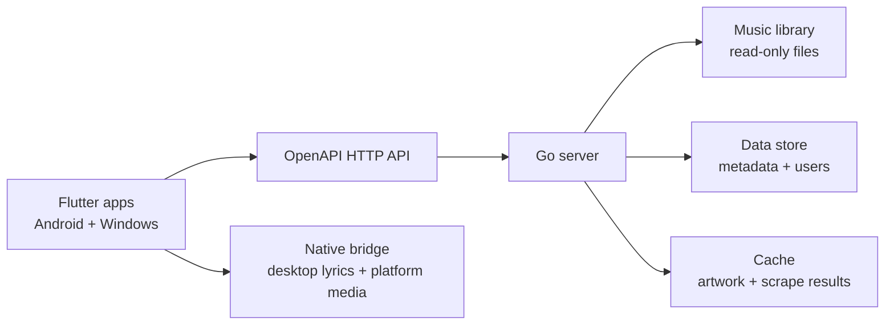

# Architecture

## Overview

The project is split into a Go backend and Flutter clients. The backend owns library scanning, metadata normalization, lyrics parsing, media access, and API contracts. Flutter owns playback UI, cross-platform client state, local rendering, and platform integrations for features that require native APIs.

## Module Boundaries

- `api/` defines the public HTTP contract. Backend and client code should treat `api/openapi.yaml` as the source of truth for request and response shapes.
- `server/` should implement the Go API, scanners, metadata readers, lyrics parsers, persistence, auth, and future streaming or transcoding workers.
- `apps/` should contain Flutter application code for Android and Windows without directly reading backend storage internals.
- `deploy/` contains Docker Compose and environment templates for local or homelab deployments.
- `docs/` records architecture, roadmap, integration notes, and decisions that affect multiple modules.

## Backend Responsibilities

- Expose service health at `/healthz` and track metadata or lyrics through the versioned `/api/v1` API.
- Keep host file paths private by returning library-relative paths or opaque URLs.
- Normalize metadata into stable track IDs, display fields, technical audio fields, artwork references, and lyrics summaries.
- Keep slow jobs such as scanning, scraping, and transcoding outside latency-sensitive request handlers.

## Flutter Responsibilities

- Consume the OpenAPI contract rather than server implementation details.
- Keep playback, queue, search, and lyrics presentation consistent across Android and Windows.
- Use platform channels only for capabilities not available through Flutter packages or the backend API.
- Cache UI-friendly data locally while treating the server as the source of truth for library metadata.

## Encoding Detection Pipeline

The server should normalize all text metadata and lyrics to UTF-8 before returning API responses.

1. Read embedded tags and sidecar files as bytes, preserving the original source path and tag frame.
2. Prefer explicit encoding markers such as BOM, ID3 frame encoding flags, container metadata, and HTTP headers.
3. Fall back to ordered detection for common music libraries: UTF-8, UTF-16 LE/BE, GB18030/GBK, Big5, Shift_JIS, EUC-KR, and Windows-1252.
4. Decode to Unicode, replace invalid sequences with explicit diagnostics, and store the detected encoding confidence.
5. Normalize line endings to LF, trim unsafe control characters, and keep timestamps intact for LRC parsing.
6. Return `encoding` in lyrics responses for debugging while always returning `text` as UTF-8 JSON.

## Lyrics Sources

- Embedded lyrics are preferred when tag metadata includes synchronized or unsynchronized lyric frames.
- Sidecar files should be matched by normalized base file name, track title, and common extensions such as `.lrc` and `.txt`.
- Remote lyrics providers can be added later behind cache and attribution rules.
- The API represents absence with `status: missing` instead of using `404` when the track exists but lyrics do not.

## Native Bridge Plan

### Android

- Use Flutter platform channels for media session controls, notification playback controls, audio focus, and lock-screen metadata.
- Add a lyrics bridge only when system overlays, accessibility surfaces, or vendor-specific desktop-lyrics style floating windows are required.
- Keep permissions explicit and user-controlled, especially for notification, storage, and overlay capabilities.

### Windows

- Use a Windows platform channel for desktop lyrics windows, global shortcuts, media keys, and system media transport controls.
- Implement desktop lyrics as a native transparent, click-through, always-on-top window synchronized by Flutter playback state.
- Keep rendering text, timing, colors, and lock state controlled by Flutter so the native layer remains a thin windowing bridge.

## Deployment Shape

The Compose stack builds the Go server image from `server/`, mounts the music library read-only, and keeps mutable state in separate `data` and `cache` volumes or host directories. Health checks call `/healthz` so orchestration can restart unhealthy containers.

## Contract Evolution

- Add new endpoints under `/api/v1` without breaking existing fields.
- Add optional response fields before making clients depend on them.
- Use the unified error response for validation, missing resources, dependency outages, and unexpected failures.
- Document breaking changes with a future `/api/v2` contract instead of changing existing response semantics.
